# Session 01 — GNS3 Lab Setup (Ubuntu)

**Duration**: ~2 hours
**OS**: Ubuntu 25.10

**Credentials summary** (keep handy):

| Machine        | Username | Password          |
| -------------- | -------- | ----------------- |
| Alice / Bob    | `ubuntu` | `ubuntu`          |
| Darth          | `pi`     | `raspberry`       |
| Cisco R1 / SW1 | —        | no login required |

---

## Prerequisites: Download everything first

> Do not start the installation until all downloads are complete. These files are large and the lab cannot proceed without them.

| Resource                      | Link                                                                                                                 | Size    |
| ----------------------------- | -------------------------------------------------------------------------------------------------------------------- | ------- |
| Cisco C7200 (router image)    | [Download](https://mega.nz/#!RZtA0SwD!XBjqI5Dkrienz7tHaYg601Dwq-ypAqWZv8Ut3mFuKoI)                                   | ~45 MB  |
| Cisco C3745 (switch image)    | [Download](https://mega.nz/#!lR8Q1SpD!5j3lYt9roopuTK6NgHBp9HRM6YP3hq8RiK_nHA7Tktw)                                   | ~38 MB  |
| Ubuntu 25.10 Cloud Image      | [Download](https://cloud-images.ubuntu.com/releases/questing/release/ubuntu-25.10-server-cloudimg-amd64.img)         | ~784 MB |
| Ubuntu Cloud Init Data        | [Download](https://github.com/GNS3/gns3-registry/raw/master/cloud-init/ubuntu-cloud/ubuntu-cloud-init-data.iso)      | ~128 KB |
| Raspbian Desktop i386 (Darth) | [Download](https://downloads.raspberrypi.com/rpd_x86/images/rpd_x86-2022-07-04/2022-07-01-raspios-bullseye-i386.iso) | ~3.4 GB |

---

## Step 1 — Install GNS3

```bash
sudo add-apt-repository ppa:gns3/ppa
sudo apt update
sudo apt install qemu-system ubridge gns3-gui gns3-server kitty tigervnc-viewer
```

When prompted during installation:

- _"Should non-superusers be able to capture packets?"_ → **Yes**
- _"Should non-superusers be able to use GNS3?"_ → **Yes**

Add your user to the required groups, then **log out and log back in**:

```bash
sudo usermod -aG ubridge,libvirt,kvm,wireshark $(whoami)
```

Verify the installation:

```bash
gns3server --version
```

---

## Step 2 — Configure NAT (internet access for the lab)

GNS3 uses `libvirt`'s virtual bridge (`virbr0`, `192.168.122.1`) to give lab VMs internet access via NAT.

**Do this once — make services start automatically at boot:**

```bash
sudo systemctl enable --now libvirtd.socket
sudo systemctl enable --now virtlogd.socket

sudo virsh net-autostart default
```

**Find your internet-facing network interface:**

```bash
ip route | grep '^default' | awk '{print $5}'
```

Example output: `enp0s3` — use your actual interface name in the steps below.

**Set up NAT rules and persist them across reboots** (replace `enp0s3` with your interface):

```bash
sudo iptables -t nat -A POSTROUTING -o enp0s3 -j MASQUERADE
sudo iptables -A FORWARD -m conntrack --ctstate RELATED,ESTABLISHED -j ACCEPT
sudo iptables -A FORWARD -i virbr0 -o enp0s3 -j ACCEPT
sudo apt install -y iptables-persistent
sudo netfilter-persistent save
```

**Start the virtual bridge now** (first time only — after reboot it starts automatically):

```bash
sudo systemctl is-active libvirtd.socket || sudo systemctl start libvirtd.socket
sudo virsh net-start default
```

If you see `Network default already active` that is fine — continue.

**Enable IP forwarding** (also needed after reboot until you add it to `/etc/sysctl.conf`):

```bash
sudo sysctl -w net.ipv4.ip_forward=1
```

> To avoid running the sysctl command after every reboot:
>
> ```bash
> echo "net.ipv4.ip_forward=1" | sudo tee -a /etc/sysctl.conf
> ```

> **Note**: a convenience script that runs all of Step 2 in one command will be published on the course GitHub repository at the end of the session.

---

## Step 3 — First GNS3 launch and server setup

Launch GNS3:

```bash
gns3
```

On first launch, the Setup Wizard appears:

**1. Select "Run the topologies on my local computer":**

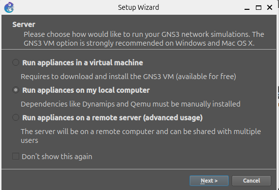

**2. Accept default local server settings (`localhost:3080`) → Next:**

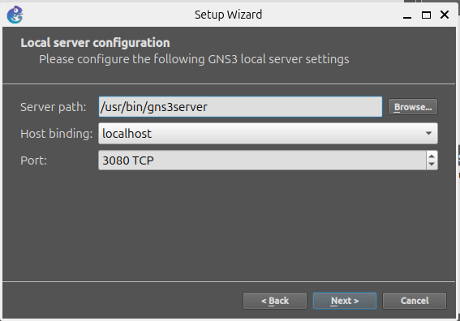

**3. Connection successful:**

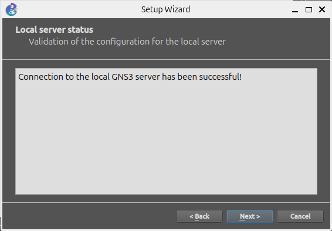

**4. Review summary → Finish:**

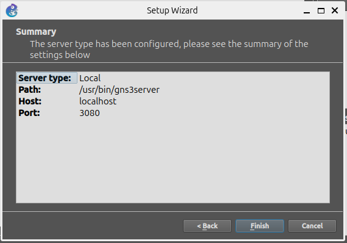

**5. GNS3 main window opens:**

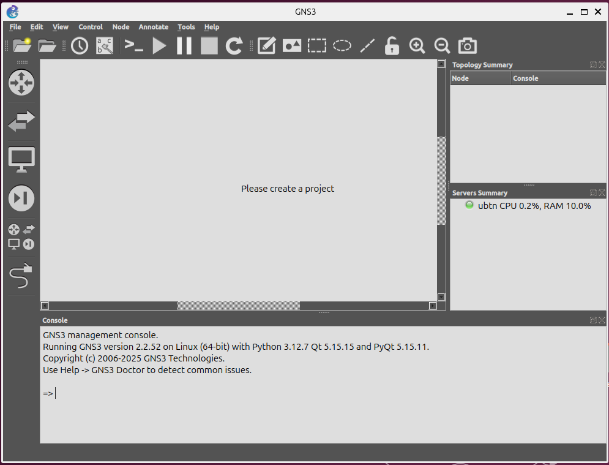

**6. Configure terminal and VNC viewer:**

Go to **Edit → Preferences → General → Console applications** and set:

- **Terminal command**: `kitty -e "%c" %i %h %p`
- **VNC viewer**: `vncviewer %h:%p`

> `vncviewer` is the binary installed by the `tigervnc-viewer` package — the name is the same.

---

## Step 4 — Create device templates

Templates let you reuse devices across all projects. We need four.

### 4a. Switch: Cisco C3745

1. Go to **File → New Template**
2. Select "Install an appliance from the GNS3 server"
3. Browse and select the `c3745` image file. If you do not see it, click **Update from online registry** and retry.
4. In the **General** tab:
   - **Symbol**: `:/symbols/affinity/square/blue/switch.svg`
   - **Default name format**: `S{0}`
   - **Initial private-config**: browse to `C3745_startup-config.cfg` from the download folder
5. In the **Slots** tab:
   - `slot 0` → `GT96100-FE`
   - `slot 1` → `NM-16ESW` ← this turns it into a switch
6. Click **OK**

> **Important**: When connecting devices, use ports **FastEthernet1/0 through 1/15** (switch ports). FastEthernet0/0 and 0/1 are routing interfaces — do not use them.

### 4b. Router: Cisco C7200

1. Go to **File → New Template**
2. Select "Install an appliance from the GNS3 server", browse and select the `c7200` image file. If you do not see it, click **Update from online registry** and retry.
3. In the **General** tab:
   - **Symbol**: `:/symbols/affinity/square/blue/router.svg`
   - **Initial private-config**: browse to `c7200_startup-config.cfg` from the download folder
4. In the **Slots** tab:
   - `slot 0` → `C7200-IO-2FE`
5. Click **OK**

> The router is pre-configured with:
>
> - `FastEthernet0/0` → NAT outside (`192.168.122.x`)
> - `FastEthernet1/0` → LAN inside (`10.0.0.1`), DHCP server for `10.0.0.0/24`

### 4c. Ubuntu Cloud Server (Alice and Bob)

The Ubuntu Cloud image acts as a **read-only template**: each VM instance (Alice, Bob) gets its own separate disk that uses the template as a backing file and grows only as data is written, up to the template's maximum size. To set the maximum size for all future instances:

```bash
qemu-img resize ~/GNS3/images/QEMU/ubuntu-25.10-server-cloudimg-amd64.img +10G
```

> This does not affect instances already created. To resize an existing instance, use `qemu-img resize` on its individual disk file under `~/GNS3/projects/<uuid>/project-files/qemu/<uuid>/hda_disk.qcow2`, then run `sudo growpart /dev/vda 1 && sudo resize2fs /dev/vda1` inside the VM.

Then create the template:

1. Go to **File → New template → Install an appliance from the GNS3 server**
2. Search for `ubuntu cloud` and select **Ubuntu Cloud Guest**
3. Select the base version, then click **Create new version**:

   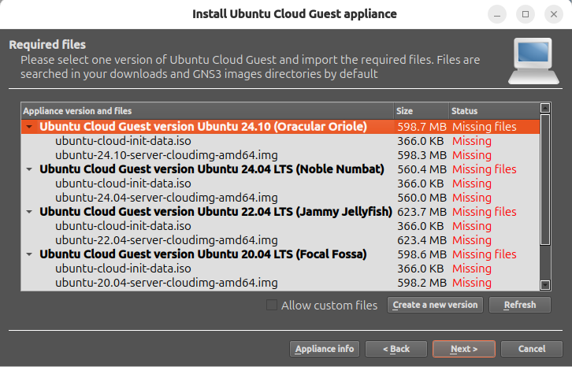

4. Enter the version name `25.10`:

   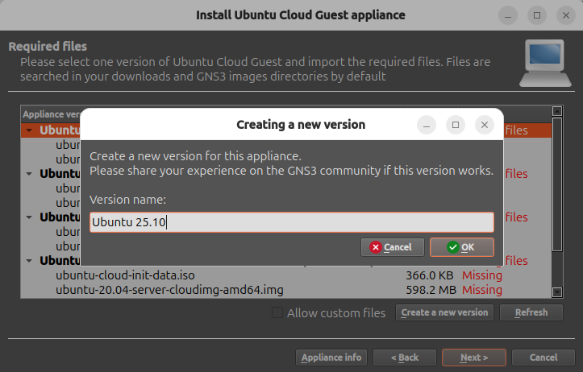

5. Enter the filename of the **cloud-init ISO** (`ubuntu-cloud-init-data.iso`):

   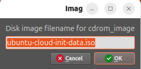

6. Enter the filename of the **cloud image** (`ubuntu-25.10-server-cloudimg-amd64.img`):

   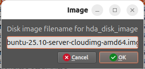

7. The new version is now available — select it and click **Next**:

   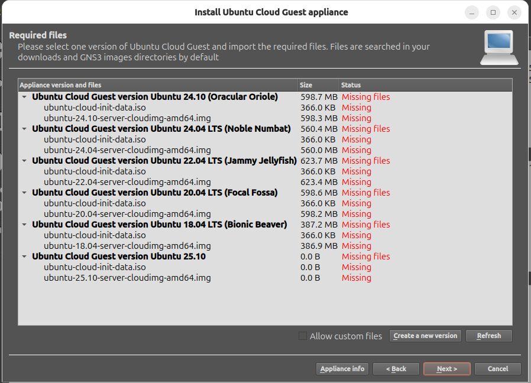

8. Import the required files:
   - The cloud image (`ubuntu-25.10-server-cloudimg-amd64.img`)
   - The cloud-init ISO (`ubuntu-cloud-init-data.iso`)

   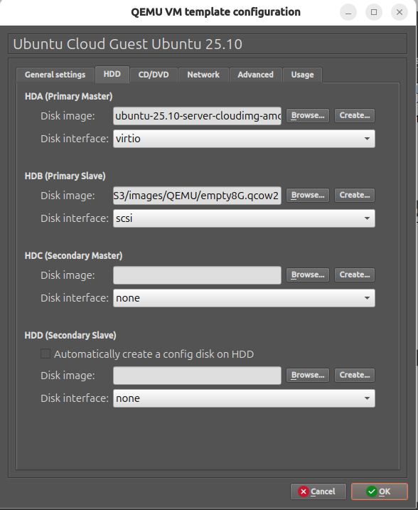

9. Click **Finish**

### 4d. Raspbian (Darth)

Then install the appliance from the GNS3 registry:

1. Go to **File → New template → Install an appliance from the GNS3 server**
2. Search for `ras` and select **Raspian** (Qemu / Raspberry Pi Foundation) → **Install**
3. Select **"Install the appliance on the main server"** → **Next**
4. Enable **Allow custom files**, select **Raspberry Pi Desktop version 2022-07-01**, click **Import** next to the ISO and select `2022-07-01-raspios-bullseye-i386.iso` → **Next** → **Finish**

The template is now created but uses a small default disk. You need to replace it with a larger one:

5. Right-click the **Raspian** template in the device panel → **Configure template**

   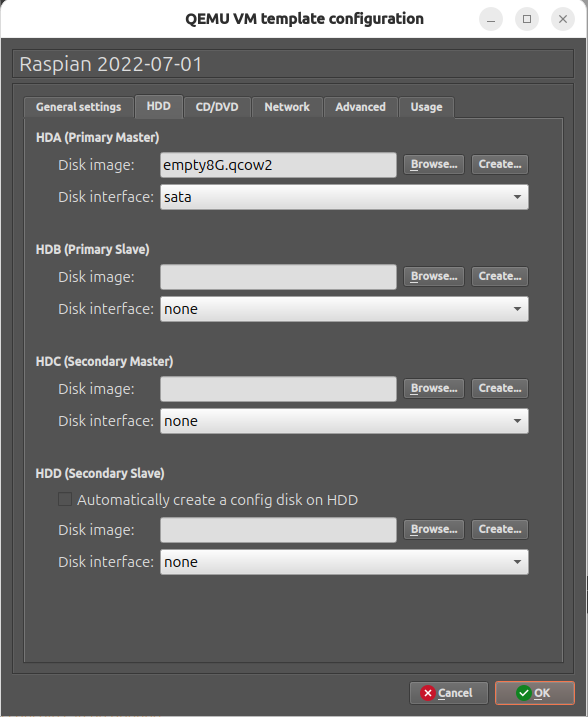

6. Go to the **HDD** tab → next to **HDA Disk image**, click **Create...**
7. In the Qemu image creator, select format **Qcow2** → **Next**:

   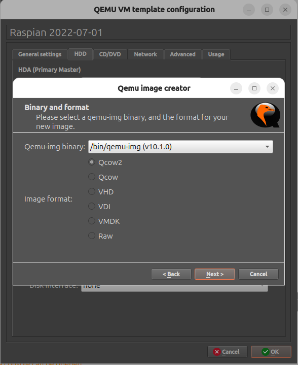

8. Leave Qcow2 options as default → **Next**:

   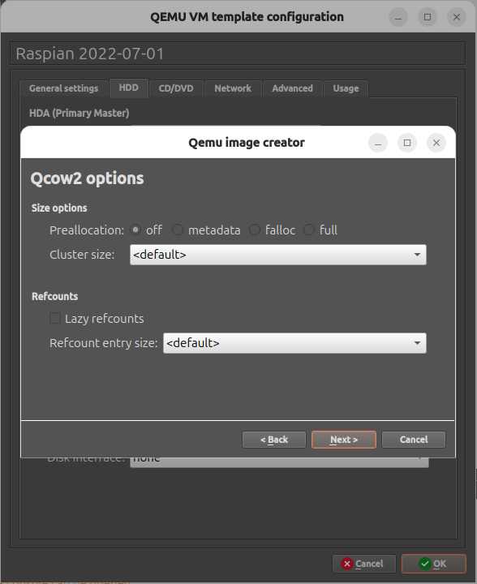

9. Set file location to `Raspian 2022-07-01-hda.qcow2` and disk size to **30,000 MiB** → **Finish**:

   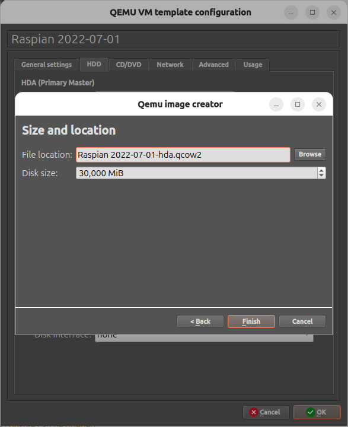

10. The new disk now appears in the **HDA Disk image** field → click **OK** to save the template:

    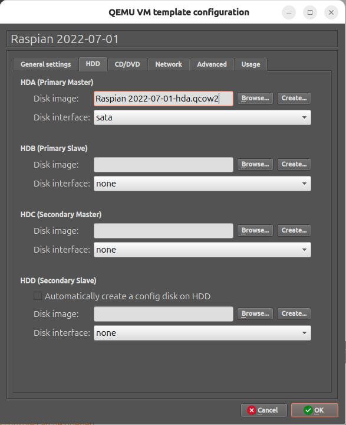

> Raspbian must be **installed** the first time it boots — it does not work live. See Step 7.

---

## Step 5 — Build the lab topology

Create a new project and add these devices:

IP addresses:
| Host | IP |
|------|----|
| R1 (gateway) | 10.0.0.1 |
| Alice | 10.0.0.10 |
| Bob | 10.0.0.20 |
| Darth | 10.0.0.30 |

### Connect the Cloud node to R1

1. Add a **Cloud** node to the canvas
2. Right-click the Cloud node → **Configure**
3. In the **Ethernet interfaces** list, select `virbr0` → click **Add** → click **OK**

   > If you skip the "Add" step the interface is not actually applied even if it appears selected.

4. Connect Cloud → `R1 FastEthernet0/0`
5. Connect `R1 FastEthernet1/0` → `SW1 FastEthernet1/0`
6. Connect `SW1 FastEthernet1/1` → Alice
7. Connect `SW1 FastEthernet1/2` → Bob
8. Connect `SW1 FastEthernet1/3` → Darth

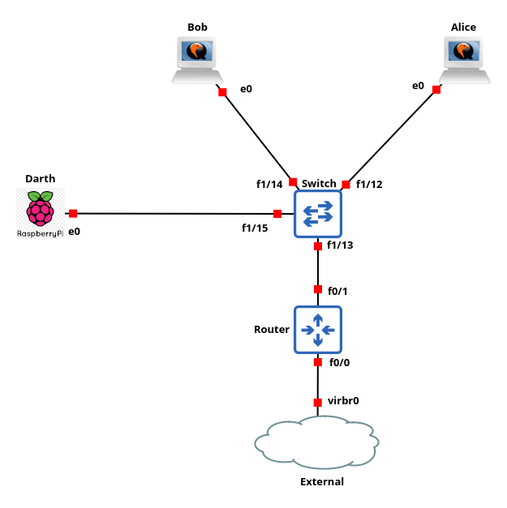

---

## Step 6 — Configure Alice and Bob (static IP via Netplan)

Login with `ubuntu` / `ubuntu`.

```bash
sudo nano /etc/netplan/00-lab.yaml
```

For **Alice** (`10.0.0.10`):

```yaml
network:
  version: 2
  renderer: networkd
  ethernets:
    ens3:
      dhcp4: no
      addresses:
        - 10.0.0.10/24
      routes:
        - to: default
          via: 10.0.0.1
      nameservers:
        addresses: [8.8.8.8, 8.8.4.4]
```

For **Bob** (`10.0.0.20`): same file, change address to `10.0.0.20/24`.

Apply on each:

```bash
sudo chmod 600 /etc/netplan/00-lab.yaml
sudo rm /etc/netplan/50-cloud-init.yaml
sudo netplan apply
ip addr show ens3
resolvectl status   # verify DNS: 8.8.8.8 8.8.4.4
```

then update system with

```bash
sudo apt update && sudo apt upgrade
```

---

## Step 7 — Install Raspbian OS (first boot only)

Drag the **Raspian** template into the project canvas and start it.

The first boot launches the Debian installer — Raspbian does not work live and must be installed.

> The installation takes **10–15 minutes**. The VM console will appear frozen during disk write — this is normal. Do not stop the VM.

1. At the boot menu, select **Install** (not Graphical install — it may crash)

   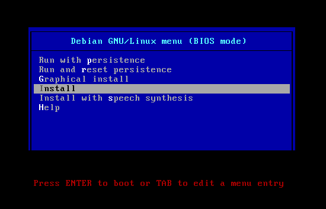

2. Select your keyboard layout (use arrow keys, then Enter)

   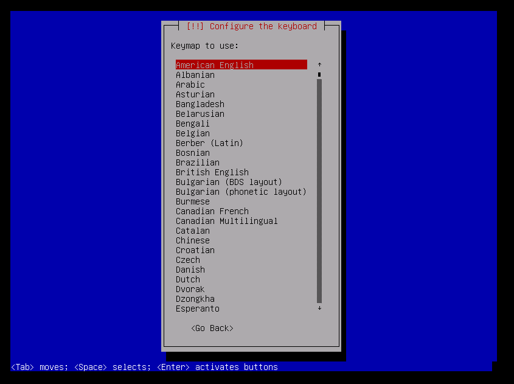

3. Partition method: select **Guided – use entire disk**

   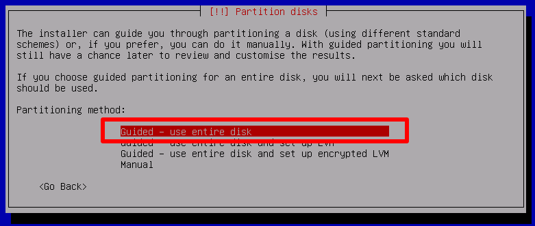

4. Partitioning scheme: select **All files in one partition**

   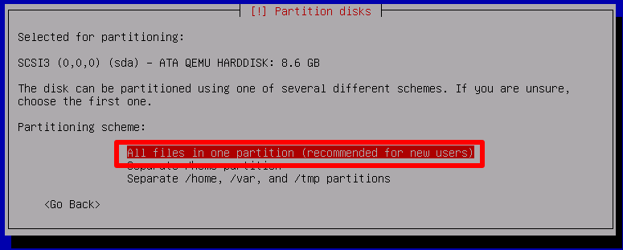

5. Review the partition summary and select **Finish partitioning and write changes to disk** → confirm **Yes**

   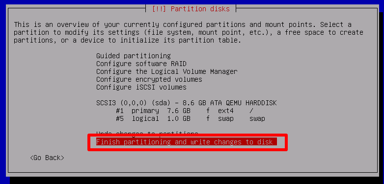

6. Wait for the installer to complete. The VM will reboot automatically into the installed system.

> This step only needs to be done once. From the next boot, Darth starts directly into Raspbian.

---

## Step 8 — Configure Darth (static IP)

Login with `pi` / `raspberry`.

Raspbian uses classic Debian networking — not Netplan.

```bash
sudo nano /etc/network/interfaces
```

Add at the end:

```
auto eth0
iface eth0 inet static
    address 10.0.0.30
    netmask 255.255.255.0
    gateway 10.0.0.1
```

Set DNS and lock the file so it is not overwritten by dhclient or resolvconf:

```bash
echo "nameserver 8.8.8.8" | sudo tee /etc/resolv.conf
echo "nameserver 8.8.4.4" | sudo tee -a /etc/resolv.conf
sudo chattr +i /etc/resolv.conf
```

Apply and verify:

```bash
sudo systemctl restart networking
ip addr show eth0
cat /etc/resolv.conf
```

---

## Verification checklist

Start all devices (right-click on canvas → Start all nodes).

**Alice** (`ubuntu` / `ubuntu`):

```bash
ping -c 3 10.0.0.1       # router
ping -c 3 10.0.0.20      # Bob
ping -c 3 10.0.0.30      # Darth
ping -c 3 8.8.8.8        # internet by IP
resolvectl status         # DNS: 8.8.8.8 8.8.4.4
ping -c 3 google.com     # internet via DNS
```

**Bob** (`ubuntu` / `ubuntu`):

```bash
ping -c 3 10.0.0.1       # router
ping -c 3 10.0.0.10      # Alice
ping -c 3 10.0.0.30      # Darth
ping -c 3 8.8.8.8        # internet by IP
resolvectl status         # DNS: 8.8.8.8 8.8.4.4
ping -c 3 google.com     # internet via DNS
```

**Darth** (`pi` / `raspberry`):

```bash
ping -c 3 10.0.0.1       # router
ping -c 3 10.0.0.10      # Alice
ping -c 3 10.0.0.20      # Bob
ping -c 3 8.8.8.8        # internet by IP
cat /etc/resolv.conf     # nameserver 8.8.8.8 / 8.8.4.4
ping -c 3 google.com     # internet via DNS
```

All checks must succeed on every machine.

---

## Troubleshooting

### `virbr0` not visible in GNS3 Cloud node

```bash
sudo systemctl start libvirtd.socket
sudo virsh net-start default
sudo virsh net-autostart default
```

If the `default` network does not exist, create it from scratch using this XML definition:

```bash
sudo virsh net-define /dev/stdin <<'EOF'
<network>
  <name>default</name>
  <forward mode="nat"/>
  <bridge name="virbr0" stp="on" delay="0"/>
  <ip address="192.168.122.1" netmask="255.255.255.0">
    <dhcp>
      <range start="192.168.122.2" end="192.168.122.254"/>
    </dhcp>
  </ip>
</network>
EOF
sudo virsh net-start default
sudo virsh net-autostart default
```

### GNS3 500 error when adding resources (disk space)

Check free space: `df -h ~`

If disk is >90% full, edit `/usr/lib/python3.x/site-packages/gns3server/compute/project_manager.py` and comment out the line `project.emit("log.warning", ...)` inside `_check_available_disk_space`.

### `libvirtd` fails: "User record for user 'libvirt-qemu' was not found"

This happens when the `libvirt-qemu` user exists but its home directory is missing or has wrong permissions:

```bash
sudo mkdir -p /var/lib/libvirt/qemu
sudo chown libvirt-qemu:libvirt-qemu /var/lib/libvirt/qemu
sudo systemctl restart libvirtd.service
```

### VM disk full (after the fact)

If you skipped creating the larger disk image, you can expand the per-instance disk after the fact.

**Step 1 — Resize the disk file (outside the VM).** Close the VM first, then right-click it in GNS3 → **"Show in file manager"** to find the path:

```bash
qemu-img resize ~/GNS3/projects/<PROJECT_UUID>/project-files/qemu/<VM_UUID>/hda_disk.qcow2 +10G
```

**Step 2 — Expand the partition and filesystem (inside the VM).** Resizing the disk file only increases the raw size — the partition and filesystem inside must be expanded too. Boot the VM and run:

For **Ubuntu** (uses `vda`):

```bash
sudo growpart /dev/vda 1
sudo resize2fs /dev/vda1
df -h /
```

For **Darth** (Raspbian, uses `sda`):

```bash
sudo growpart /dev/sda 1
sudo resize2fs /dev/sda1
df -h /
```

> To avoid this: always resize the template disk image before creating instances (see Step 4c for Ubuntu, Step 4d for Darth).

### GNS3 installation fails: broken `vinagre` dependency

At certain times the `vinagre` package in the GNS3 PPA is broken and blocks installation. Fix it manually:

```bash
wget http://launchpadlibrarian.net/722482020/vinagre_3.22.0-8ubuntu5_amd64.deb
sudo dpkg -i vinagre_3.22.0-8ubuntu5_amd64.deb
sudo apt-get -f install
```

Then retry the GNS3 installation.

### QEMU hardware acceleration compatibility issues

If VMs crash or behave unexpectedly, disable hardware acceleration: go to **Edit → Preferences → QEMU** and uncheck both hardware acceleration options.

### `virbr0` uses a different IP than `192.168.122.1`

The router startup config assumes `virbr0` is at `192.168.122.1`. If your libvirt default network uses a different subnet, the router will not get internet access.

Check your virbr0 address:

```bash
ip addr show virbr0
```

If it differs, either reconfigure the libvirt default network or update the router startup config accordingly.

### Terminal columns do not resize automatically

If the terminal inside a VM does not adjust its width when you resize the window:

```bash
sudo apt install xterm
resize
```

Run `resize` each time you resize the terminal window.
