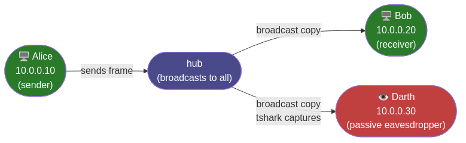

# Session 02 — Symmetric Cryptography & Steganography

**Network Security Lab · University of Calabria · A.Y. 2025/2026**

**Duration**: ~3 hours
**Environment**: GNS3 — Alice `10.0.0.10`, Bob `10.0.0.20`, Darth `10.0.0.30`



---

## Before you start

The GNS3 lab from Session 01 must be running. Verify that all machines can reach each other before you touch anything else.

> **Before you do anything else**: your topology from Session 01 uses a switch. For this session you need to replace it with a **hub**. A switch forwards frames only to the intended destination port — Darth would receive nothing and the sniffing exercises would not work. A hub broadcasts every frame to all ports, which is what makes passive capture possible.
>
> In GNS3: delete the switch, add a hub from the device list, and reconnect Alice, Bob, and Darth to it. Once this session is over you can swap back to the switch.

**On Alice**:

```bash
ping -c 2 10.0.0.1     # router
ping -c 2 10.0.0.20    # Bob
```

If either ping fails, fix the network before proceeding.

**Install required tools on Alice and Bob**:

```bash
sudo apt update
sudo apt install -y netcat-openbsd tshark steghide python3-pip
pip3 install pycryptodome --break-system-packages
```

**Install on Darth**:

```bash
sudo apt update
sudo apt install -y tshark
```

**Copy the scripts** to Alice and Bob. On the machine that has the repo, serve the scripts over HTTP:

```bash
# On the machine with the script (your host machine)
cd /scripts
python3 -m http.server 8080
```

Then on **Alice** and **Bob**, download the blank versions — these are the files you will complete during the exercises:

```bash
wget http://192.168.122.1:8080/cryptocat_blank.py
wget http://192.168.122.1:8080/crypto_demo_blank.py
```

> If you get stuck or want to verify your solution, the complete versions (`cryptocat.py`, `crypto_demo.py`) are available at the same address.

Quick sanity check — make sure pycryptodome is reachable:

```bash
python3 -c "from Crypto.Cipher import AES; print('pycryptodome ok')"
```

---

## Exercise 1 — OpenSSL: encrypting files and messages

### The idea

Symmetric encryption is the simplest security primitive to understand: one shared secret key encrypts a message, and the same key decrypts it. There is no separation between who can encrypt and who can decrypt — anyone who has the key can do both. This is both its strength (it is fast and simple) and its weakness (both parties must already share the key before they can communicate securely).

Today the cipher is AES-256-CBC. AES operates on 128-bit blocks. CBC (Cipher Block Chaining) means each block is XOR'd with the previous ciphertext block before being encrypted, so two identical blocks in the plaintext produce different blocks in the ciphertext. The "256" refers to the key size in bits: 2²⁵⁶ possible keys, which is more than the number of atoms in the observable universe. Brute force is not a realistic attack.


Before you run anything: **if the ciphertext is transmitted openly over the network and the algorithm is public knowledge, what exactly is keeping the message secret?**

---

### 1a — Encrypt and decrypt a file

On **Alice**, create a message and encrypt it:

```bash
echo "Meet me at the library at 5pm" > message.txt

openssl enc -e -aes-256-cbc -pbkdf2 -base64 \
    -k mysecretkey \
    -in message.txt \
    -out message.enc
```

| Flag             | Meaning                                                 |
| ---------------- | ------------------------------------------------------- |
| `-e`             | encrypt (as opposed to `-d` for decrypt)                |
| `-aes-256-cbc`   | AES with a 256-bit key in CBC mode                      |
| `-pbkdf2`        | derive the actual AES key from the password securely    |
| `-base64`        | encode the output as printable text (default is binary) |
| `-k mysecretkey` | the shared password                                     |

Inspect the encrypted file:

```bash
cat message.enc
```

**Checkpoint**: you should see a block of base64 text beginning with `U2Fsd` (OpenSSL's base64 header). The original message is nowhere in it.

Decrypt it:

```bash
openssl enc -d -aes-256-cbc -pbkdf2 -base64 \
    -k mysecretkey \
    -in message.enc \
    -out message_recovered.txt

cat message_recovered.txt
```

**Checkpoint**: `message_recovered.txt` contains the original sentence exactly.

---

### 1b — Wrong key

Try decrypting with a different password:

```bash
openssl enc -d -aes-256-cbc -pbkdf2 -base64 \
    -k wrongkey \
    -in message.enc
```

**Checkpoint**: OpenSSL prints `bad decrypt` and exits with a non-zero code. There is no partial decryption — you either have the right key or you get nothing.

_What does this tell you about the relationship between the key and the ciphertext?_

---

### 1c — Encrypt directly in the terminal

You can pipe text through `openssl` without touching files:

```bash
echo "Hello Bob" | openssl enc -e -aes-256-cbc -pbkdf2 -base64 -k mysecretkey
```

Copy the base64 output and decrypt it in the same terminal:

```bash
echo "PASTE_YOUR_CIPHERTEXT_HERE" | openssl enc -d -aes-256-cbc -pbkdf2 -base64 -k mysecretkey
```

**Checkpoint**: the original string `Hello Bob` appears.

Run the encrypt command again. Notice the ciphertext is different from the first run even though the message and key are identical. This is the initialization vector (IV) at work — OpenSSL generates a fresh random IV each time, so the same plaintext + same key never produces the same ciphertext.

---

### 1d — Transfer an encrypted file to Bob

On **Bob**, open a receiving socket:

```bash
nc -l -p 5000 > received.enc
```

On **Alice**, send the encrypted file:

```bash
nc -N 10.0.0.20 5000 < message.enc
```

On **Bob**, decrypt and read:

```bash
openssl enc -d -aes-256-cbc -pbkdf2 -base64 \
    -k mysecretkey \
    -in received.enc \
    -out received.txt

cat received.txt
```

**Checkpoint**: Bob reads the original message. Note that the key `mysecretkey` was never sent over the network — Alice and Bob agreed on it in advance ("out of band"). This assumption is the core of all symmetric cryptography.

---

### 1e — Darth intercepts

On **Darth**, start capturing traffic on port 5000 **before** Alice sends anything:

```bash
sudo tshark -i eth0 -f "tcp port 5000" -w /tmp/capture.pcap
```

When Alice has finished sending (Ctrl-C to stop capture), read the payload:

```bash
sudo tshark -r /tmp/capture.pcap -T fields -e data 2>/dev/null | xxd -r -p
```

> If `eth0` is wrong, check the interface name with `ip link show` and substitute accordingly. Common alternatives: `ens3`, `enp0s3`.

Now repeat the transfer from step 1d (Bob listens, Alice sends). Watch Darth's terminal.

**Checkpoint**: Darth sees base64-encoded ciphertext — not the original message.

To make the contrast clear, repeat with **no encryption** — just raw netcat:

```bash
# Bob
nc -l -p 5000

# Alice
echo "Meet me at the library at 5pm" | nc 10.0.0.20 5000
```

**Checkpoint**: Darth now reads the message in plain text.

### Takeaway

The security of symmetric encryption depends entirely on the key. The algorithm (AES) is public. The ciphertext travels openly over the network. Without the key, the ciphertext is useless. **The key is the entire security model.**

---

## Exercise 2 — CryptoCat: an encrypted chat channel

### The idea

Exercise 1 showed you how to encrypt a file and transfer it. Exercise 2 applies the same idea to a live interactive chat: every message you type is encrypted before it leaves your machine, and every message you receive is decrypted before it appears on screen. The encryption is the same `openssl enc` command from Exercise 1 — `cryptocat.py` just automates it inside a TCP socket.

Before you start: **in a plaintext netcat session, what can Darth learn? In an encrypted one, what can Darth still learn even if he can't read the messages?**

---

### 2a — Plaintext baseline

On **Darth**, start capturing on port 9999:

```bash
sudo tshark -i eth0 -f "tcp port 9999" -w /tmp/capture.pcap
```

On **Bob**, listen with plain netcat:

```bash
nc -l -p 9999
```

On **Alice**, connect with plain netcat:

```bash
nc 10.0.0.20 9999
```

Type a message on Alice (e.g. `Hello Bob, this is our secret`). Press Enter. Then stop all connections (Ctrl-C on Alice, Bob, and Darth).

On **Darth**, read the captured payload:

```bash
sudo tshark -r /tmp/capture.pcap -T fields -e data 2>/dev/null | xxd -r -p
```

**Checkpoint**: Darth sees the message in clear text. This is how the internet looked before HTTPS.

---

### 2b — The encrypted channel

Open `cryptocat_blank.py`. Fill in the two `???` placeholders in `openssl_encrypt` and `openssl_decrypt` — the flags are exactly the ones you used in Exercise 1.

Test it locally first:

```bash
echo "test" | python3 -c "
import subprocess
cmd = 'echo test | openssl enc ???'   # paste your flags here
r = subprocess.run(cmd, shell=True, capture_output=True, text=True)
print(r.stdout)
"
```

Once it works, run it on the two machines.

On **Bob** (server):

```bash
python3 cryptocat.py 0.0.0.0 9999 -m server -k mysecretkey
```

On **Alice** (client):

```bash
python3 cryptocat.py 10.0.0.20 9999 -m client -k mysecretkey
```

On **Darth**, capture again:

```bash
sudo tshark -i eth0 -f "tcp port 9999" -w /tmp/capture.pcap
```

Type a message on Alice. Bob receives it decrypted and printed. Then stop Darth's capture (Ctrl-C).

On **Darth**, read the captured payload:

```bash
sudo tshark -r /tmp/capture.pcap -T fields -e data 2>/dev/null | xxd -r -p
```

**Checkpoint**: Darth sees only ciphertext — the message content is completely opaque.

Type a few messages in both directions (Alice → Bob and Bob → Alice). Confirm that Darth sees nothing readable.

---

### 2c — Wrong key

Stop the session. Restart Bob's server with a **different** key:

```bash
python3 cryptocat_blank.py 0.0.0.0 9999 --mode server --key wrongkey
```

Alice connects with the original key:

```bash
python3 cryptocat_blank.py 10.0.0.20 9999 --mode client --key mysecretkey
```

Type a message.

**Checkpoint**: Bob receives `[decryption failed — wrong key?]` — not the message.

### Takeaway

Both parties must share the same key before they can communicate. If the keys don't match, communication fails completely — there is no degraded mode. And the big open question: how did Alice and Bob agree on `mysecretkey` in the first place? If they sent it over the network, Darth could have intercepted it. This is the **key distribution problem** — the fundamental limitation of symmetric cryptography. Session 03 (asymmetric crypto and TLS) solves it.

---

## Exercise 3 — Steganography: hiding a message in an image

### The idea

Encryption and steganography are often confused, but they address different threats. Encryption hides the _content_ of a message — an attacker who intercepts it knows that a secret communication happened, they just cannot read it. Steganography hides the _existence_ of a message — an observer sees an ordinary-looking image and has no reason to suspect anything is hidden inside.

`steghide` works by modifying the least-significant bit of each pixel's colour value. A pixel at value 200 becomes 201 — a change imperceptible to the human eye, but enough to encode one bit of data. The result is an image that looks identical to the original but carries a hidden payload.

Before you run anything: **if an attacker knows that steganography is being used (but doesn't know which image carries the payload), what can they do? What if they don't know steganography is being used at all?**

---

### 3a — Prepare the image and the message

On **Alice**, download a JPEG image:

```bash
wget -O cover.jpg https://www.gstatic.com/webp/gallery/1.jpg
```

Verify it is actually a JPEG:

```bash
file cover.jpg
```

**Checkpoint**: output should say `JPEG image data`. If it says PNG or WebP, convert it:

```bash
sudo apt install imagemagick
magick cover.jpg cover_fixed.jpg && mv cover_fixed.jpg cover.jpg
```

Create a secret message:

```bash
echo "The package is under the third bench in the park." > secret.txt
```

---

### 3b — Embed the message

```bash
steghide embed -cf cover.jpg -ef secret.txt -sf stego.jpg -p stegosecret
```

| Flag             | Meaning                                   |
| ---------------- | ----------------------------------------- |
| `-cf cover.jpg`  | the cover image (hides the data)          |
| `-ef secret.txt` | the file to embed                         |
| `-sf stego.jpg`  | the output steganographic image           |
| `-p stegosecret` | the password protecting the embedded data |

Compare the two images:

```bash
ls -lh cover.jpg stego.jpg
```

**Checkpoint**: the file sizes differ by at most a few bytes. If you can open both in an image viewer, they look identical.

---

### 3c — Send the image to Bob and extract

On **Darth**, start capturing **before** Alice sends:

```bash
sudo tshark -i eth0 -f "tcp port 5000" -w /tmp/capture_stego.pcap
```

On **Bob**, receive the image:

```bash
nc -l -p 5000 > stego.jpg
```

On **Alice**, send it:

```bash
nc -N 10.0.0.20 5000 < stego.jpg
```

Stop Darth's capture (Ctrl-C). On **Darth**, extract what was intercepted as an image:

```bash
sudo tshark -r /tmp/capture_stego.pcap -T fields -e data 2>/dev/null | xxd -r -p > /tmp/darth_intercepted.jpg
```

Open `/tmp/darth_intercepted.jpg`. It looks like an ordinary JPEG. Darth has no reason to suspect anything is hidden inside.

On **Bob**, extract the hidden message:

```bash
steghide extract -sf stego.jpg -p stegosecret
cat secret.txt
```

**Checkpoint**: Bob reads `The package is under the third bench in the park.` Darth intercepted the same image and saw nothing suspicious — that is the point of steganography.

---

### 3d — Without the password

Run `steghide info` on the image:

```bash
steghide info stego.jpg
```

**Checkpoint**: steghide confirms that something is embedded — it can detect the statistical signature of the LSB encoding. But it cannot reveal the content.

Try extracting with a wrong password:

```bash
steghide extract -sf stego.jpg -p wrongpassword
```

**Checkpoint**: extraction fails with `could not extract any data`.

_What does this tell you about combining steganography and encryption?_

### Takeaway

Steganography provides obscurity, not security. If an attacker suspects that steganography is in use, tools like `steghide info` can confirm a payload is present — they just can't read it without the password. For real protection, combine both: encrypt the message first, then hide the ciphertext inside an image. Even if the stego image is found, the content remains encrypted.

---

## Exercise 4 — Python pycryptodome: three experiments

### The idea

The command-line tools you've used so far (`openssl`, `steghide`) abstract away most of the internals. In real applications — messaging apps, file systems, network protocols — encryption is implemented in code, and the programmer must make choices about IVs, modes, and key derivation. Bad choices lead to real vulnerabilities.

`pycryptodome` is the standard Python library for cryptographic primitives. The script `crypto_demo_blank.py` runs three experiments, but it has gaps you need to fill before it works. Each `???` is a small choice — a mode constant or a function call — that you should be able to answer from what you've seen so far. Read the comments in the file carefully before filling anything in.

Before you start experiment 1: **if you encrypt the same message twice with the same key, do you expect to get the same ciphertext? Why or why not?**

---

### 4a — Basic AES-256-CBC in Python

```bash
python3 crypto_demo_blank.py 1
```

Expected output structure:

```
Key (hex) : <64 hex chars — 32 bytes — the AES-256 key>
IV  (hex) : <32 hex chars — 16 bytes — the initialization vector>

Plaintext  : Hello from Python!
Ciphertext : <base64-encoded ciphertext>
Recovered  : Hello from Python!
```

Run it a second time.

**Checkpoint**: the ciphertext is different in the second run even though the plaintext and algorithm are the same. A new random key and IV are generated each time — this is the correct behaviour.

_Where is the IV in relation to the ciphertext — should Bob receive it too? Is it a secret?_

---

### 4b — IV reuse attack

```bash
python3 crypto_demo_blank.py 2
```

Expected output:

```
── Fixed IV (bad) ──────────────────────────────────────
  Ciphertext A : <base64>
  Ciphertext B : <same base64>
  Identical?   : True  ← attacker knows msg_a == msg_b

── Random IV (good) ────────────────────────────────────
  Ciphertext A : <base64>
  Ciphertext B : <different base64>
  Identical?   : False  ← attacker learns nothing
```

**Checkpoint**: `Identical? True` for the fixed-IV case, `Identical? False` for the random-IV case.

The scenario: Alice sends the same bank transfer message twice. With a fixed IV, an attacker watching the wire sees two identical ciphertexts and immediately knows the messages are the same — without decrypting anything. With a random IV, the two ciphertexts are completely unrelated. The IV is 16 bytes. Generating a fresh one costs nothing.

_What more could an attacker learn from repeated identical ciphertexts beyond "the messages are the same"?_

---

### 4c — ECB vs CBC mode


```bash
python3 crypto_demo_blank.py 3
```

Expected output (hex values change each run — what matters is whether blocks are equal):

```
Plaintext: AAAAAAAAAAAAAAAA AAAAAAAAAAAAAAAA AAAAAAAAAAAAAAAA AAAAAAAAAAAAAAAA

ECB ciphertext blocks:
  Block 1: <hex>
  Block 2: <same hex>
  Block 3: <same hex>
  Block 4: <same hex>

CBC ciphertext blocks:
  Block 1: <hex>
  Block 2: <different hex>
  Block 3: <different hex>
  Block 4: <different hex>

ECB — all blocks identical? True  ← attacker sees the pattern
CBC — all blocks identical? False  ← no pattern visible
```

**Checkpoint**: `ECB — all blocks identical? True` and `CBC — all blocks identical? False`.

The input is four identical 16-byte blocks. In ECB (Electronic Codebook) mode, each block is encrypted independently — same input always produces same output. An attacker who cannot decrypt the ciphertext can still see the repetition and learn something about the structure of the plaintext. In CBC, each block is XOR'd with the previous ciphertext block before encryption, breaking the pattern completely.

The canonical demonstration of why ECB is broken is the "ECB penguin": encrypt a bitmap image of the Linux Tux mascot with AES-ECB and the penguin outline is still perfectly visible in the ciphertext. Search for it.

### Takeaway

Never use ECB. The mode of operation matters as much as the cipher itself. Use CBC at minimum; use AES-GCM (authenticated encryption) for any new system where you also need to detect tampering.

## Troubleshooting

### `tshark` shows nothing

Check the interface name:

```bash
ip link show
```

On GNS3 VMs the interface is usually `ens3` or `eth0`. Replace in the capture command:

```bash
sudo tshark -i ens3 -f "tcp port 5000" -w /tmp/capture.pcap
```

### `steghide embed` fails: cover file format error

The downloaded file is not a real JPEG:

```bash
file cover.jpg
```

If it says PNG or WebP:

```bash
sudo apt install imagemagick
magick cover.jpg cover_real.jpg
mv cover_real.jpg cover.jpg
```

### pycryptodome import error

```bash
python3 -c "from Crypto.Cipher import AES; print('ok')"
```

If it fails, the apt package installs under a different namespace and does not work. Use pip:

```bash
sudo apt install -y python3-pip
pip3 install pycryptodome --break-system-packages
```

### netcat: connection refused

Bob must start listening **before** Alice connects. Always start the receiver first. Check that the port number matches on both sides.

### cryptocat: garbage output on Bob's side

Both sides must use **exactly** the same key string. Check for trailing spaces, uppercase differences, or copy-paste errors. The key is case-sensitive.

### openssl: bad decrypt

The decrypt command must use the same flags as the encrypt command. The most common mistake: encrypting with `-base64` and forgetting it during decryption (or vice versa).

---

## Open questions

You don't need to answer these now — they're for after the session.

1. In step 1e, Darth can see that Alice is sending something to Bob, and approximately when and how much data. What does this tell you about what encryption actually protects and what it doesn't?
2. `cryptocat.py` uses `openssl enc` via subprocess for each message. What are the performance implications of this design? How would a production encrypted chat application differ?
3. `steghide info` can detect that a payload is present. What does this mean for steganography as a defence against a determined attacker who knows to look for it?
4. In experiment 4b, the fixed IV leaks the fact that two messages are identical. In some older stream cipher modes (not CBC), IV reuse is catastrophic in a much stronger sense — it allows full plaintext recovery. Can you think of why?
5. AES-GCM adds authentication to encryption. What attack does authentication prevent that CBC alone does not?
