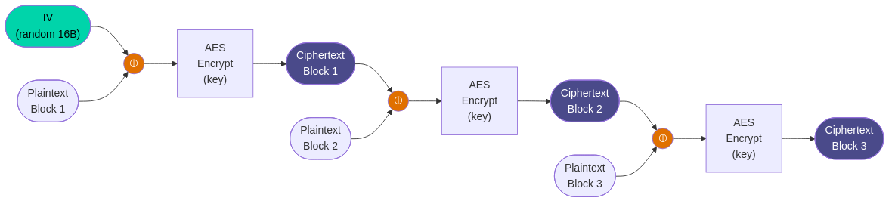
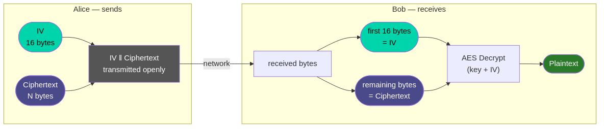

# FAQ Session 2

---

## Symmetric cryptography — basic concepts

**Q: If the AES algorithm is public, why can't it be reversed without the key?**
ITA: AES è una funzione matematica non lineare progettata specificamente per essere facile da calcolare in avanti (con la chiave) e computazionalmente impossibile da invertire senza. Non è segretezza dell'algoritmo che garantisce la sicurezza — è la complessità matematica della funzione e la dimensione del keyspace. Questo principio si chiama principio di Kerckhoffs (1883): un sistema deve essere sicuro anche se tutto tranne la chiave è di pubblico dominio.
ENG: AES is a nonlinear mathematical function specifically designed to be easy to compute forward (with the key) and computationally infeasible to invert without it. It is not the secrecy of the algorithm that provides security — it is the mathematical complexity of the function and the size of the keyspace. This is called Kerckhoffs's principle (1883): a system should be secure even if everything except the key is public knowledge.

---

**Q: How long would it take to brute-force AES-256?**
ITA: Con la potenza computazionale attuale (inclusi i supercomputer), ci vorrebbero miliardi di volte l'età dell'universo per esaurire il keyspace AES-256. Non è una questione di potenza di calcolo disponibile — è fisicamente impossibile con qualsiasi tecnologia classica immaginabile. Il problema reale è sempre la password debole, non il cifrario.
ENG: With current computational power (including supercomputers), it would take billions of times the age of the universe to exhaust the AES-256 keyspace. It is not a matter of available computing power — it is physically impossible with any imaginable classical technology. The real problem is always the weak password, not the cipher.

---

**Q: Don't quantum computers break AES?**
ITA: L'algoritmo di Grover riduce effettivamente la sicurezza di AES-256 a quella equivalente di AES-128 — non la azzera. AES-128 è ancora considerato sicuro anche nel modello post-quantistico. AES-256 è esplicitamente consigliato per la sicurezza post-quantistica. RSA e la crittografia a chiave pubblica basata su fattorizzazione sono molto più vulnerabili ai computer quantistici (algoritmo di Shor).
ENG: Grover's algorithm does effectively reduce AES-256 security to the equivalent of AES-128 — it does not break it. AES-128 is still considered secure even in the post-quantum model. AES-256 is explicitly recommended for post-quantum security. RSA and public-key cryptography based on factorization are far more vulnerable to quantum computers (Shor's algorithm).

---

**Q: Why do we use a password instead of a 256-bit key directly?**
ITA: Perché gli esseri umani non riescono a memorizzare 32 byte casuali. In produzione, dove è possibile, si usano chiavi casuali generate da un generatore crittograficamente sicuro (CSPRNG) e gestite da un key management system. La password con PBKDF2 è un compromesso tra usabilità e sicurezza: abbastanza sicuro per molti casi d'uso, non ideale per sistemi ad alta sicurezza.
ENG: Because humans cannot memorize 32 random bytes. In production, where possible, randomly generated keys from a cryptographically secure pseudorandom number generator (CSPRNG) are used and managed by a key management system. Password with PBKDF2 is a tradeoff between usability and security: sufficient for many use cases, not ideal for high-security systems.

---

**Q: Does AES encrypt data in real time? Is it fast enough for video streaming?**
ITA: Sì. Su hardware moderno con istruzioni AES-NI (presenti in quasi tutti i processori dal 2010 in poi), AES raggiunge velocità di cifratura nell'ordine dei gigabyte al secondo per core. TLS usa AES-GCM per cifrare tutto il traffico HTTPS, incluso lo streaming video in 4K, in tempo reale senza overhead percepibile.
ENG: Yes. On modern hardware with AES-NI instructions (present in almost all processors since 2010), AES reaches encryption speeds in the order of gigabytes per second per core. TLS uses AES-GCM to encrypt all HTTPS traffic, including 4K video streaming, in real time with no perceptible overhead.

---

## IV and cipher modes

**Q: If the IV is not secret, what is the point? Can't the attacker compute it too?**
ITA: L'IV non serve a nascondere informazioni — serve a garantire che la stessa chiave + plaintext non producano mai lo stesso ciphertext. L'attaccante sa che c'è un IV, può vederlo nel ciphertext, ma non gli serve per decifrare. Senza la chiave, conoscere l'IV è inutile. Con la chiave, non ne ha bisogno perché può già decifrare tutto.
ENG: The IV does not serve to hide information — it ensures that the same key + plaintext never produce the same ciphertext. The attacker knows there is an IV, can see it in the ciphertext, but it is of no use without the key. Without the key, knowing the IV is useless. With the key, it is not needed because decryption is already possible.

---

**Q: What exactly happens if I reuse the same IV twice with CBC?**

ITA: In CBC il primo blocco di ciphertext dipende da IV XOR plaintext_block1. Se l'IV è lo stesso, i primi blocchi di ciphertext di due messaggi con lo stesso prefisso di plaintext saranno identici — l'attaccante vede il pattern. Con IV diversi, anche due messaggi identici producono ciphertext completamente diversi. Nota: in CTR e nei cifrari a flusso il riuso dell'IV è molto più catastrofico (vedi open question 4).
ENG: In CBC, the first ciphertext block depends on IV XOR plaintext_block1. If the IV is the same, the first ciphertext blocks of two messages with the same plaintext prefix will be identical — the attacker sees the pattern. With different IVs, even two identical messages produce completely different ciphertexts. Note: in CTR mode and stream ciphers, IV reuse is far more catastrophic (see open question 4).

---

**Q: How do I send the IV to Bob if it's not secret? Do I send it in plaintext?**

ITA: Sì, esattamente. Il modo standard è concatenarlo al ciphertext: IV || ciphertext, dove || significa concatenazione. Bob legge i primi 16 byte (la lunghezza dell'IV è fissa e nota), li usa come IV, decifra il resto. Non serve nessun canale sicuro per l'IV — solo per la chiave.
ENG: Yes, exactly. The standard way is to prepend it to the ciphertext: IV || ciphertext, where || means concatenation. Bob reads the first 16 bytes (the IV length is fixed and known), uses them as the IV, decrypts the rest. No secure channel is needed for the IV — only for the key.

---

**Q: Why CBC and not CTR? I've read that CTR is faster.**
ITA: CTR è parallelizzabile (i blocchi possono essere cifrati indipendentemente) ed è più veloce su hardware senza AES-NI. La scelta di CBC in questo lab è didattica — è più facile visualizzare il chaining. In produzione, AES-GCM (che usa CTR internamente + autenticazione) è la scelta corretta. CTR senza autenticazione ha il problema del riuso dell'IV catastrofico (vedi open question 4).
ENG: CTR is parallelizable (blocks can be encrypted independently) and faster on hardware without AES-NI. The choice of CBC in this lab is pedagogical — the chaining is easier to visualize. In production, AES-GCM (which uses CTR internally + authentication) is the correct choice. CTR without authentication has the catastrophic IV reuse problem (see open question 4).

---

## PBKDF2 and key derivation

**Q: Are 10,000 PBKDF2 iterations enough? I've heard millions are used.**
ITA: Dipende dal contesto. Per openssl enc usato in lab è sufficiente. Per password di autenticazione (login, password manager), le raccomandazioni attuali (OWASP 2024) sono 600.000 iterazioni con PBKDF2-HMAC-SHA256. Il numero cresce nel tempo perché l'hardware degli attaccanti diventa più veloce. Argon2 (vincitore della Password Hashing Competition 2015) è oggi la scelta migliore per l'hashing di password perché è resistente anche agli attacchi con GPU e ASIC.
ENG: It depends on context. For openssl enc in a lab setting it is sufficient. For authentication passwords (login, password managers), current recommendations (OWASP 2024) are 600,000 iterations with PBKDF2-HMAC-SHA256. The number grows over time because attacker hardware gets faster. Argon2 (winner of the Password Hashing Competition 2015) is today the best choice for password hashing because it is also resistant to GPU and ASIC attacks.

---

**Q: What are rainbow tables?**
ITA: Una rainbow table è una struttura dati precalcolata che mappa hash di password ai loro valori originali. Senza salt, se due utenti usano la stessa password producono lo stesso hash — e l'attaccante può usare la tabella precalcolata per trovare la password in millisecondi invece di ricalcolare. Con un salt casuale per ogni password, l'attaccante dovrebbe costruire una tabella separata per ogni salt — computazionalmente impraticabile.
ENG: A rainbow table is a precomputed data structure mapping password hashes back to their original values. Without a salt, if two users use the same password they produce the same hash — and the attacker can use the precomputed table to find the password in milliseconds instead of recomputing. With a random salt per password, the attacker would need to build a separate table for each salt — computationally infeasible.

---

## Steganography

**Q: steghide modifies pixels — can't you see it?**
ITA: I monitor hanno tipicamente una profondità di colore di 8 bit per canale. Un pixel che vale 200 che diventa 201 è una variazione dello 0,4% su un range di 0-255 — il sistema visivo umano non la percepisce, specialmente in zone di immagine con texture complessa. steghide sceglie anche i pixel in modo pseudo-casuale per distribuire l'impatto sull'intera immagine invece di concentrarlo in un'area.
ENG: Monitors typically have 8-bit color depth per channel. A pixel at value 200 becoming 201 is a 0.4% variation on a 0–255 range — the human visual system does not perceive it, especially in areas of complex texture. steghide also selects pixels pseudorandomly to distribute the impact across the entire image rather than concentrating it in one area.

---

**Q: How much data can I hide in an image with steghide?**
ITA: La capacità dipende dalla dimensione dell'immagine. La regola approssimativa per steganografia LSB è circa 1 bit per pixel — quindi per un JPEG da 1 megapixel circa 125 KB di payload. steghide in realtà è più conservativo per ridurre la rilevabilità statistica. In pratica, un'immagine da 1 MB può nascondere qualche decina di KB senza anomalie visibili.
ENG: Capacity depends on image size. The rough rule for LSB steganography is approximately 1 bit per pixel — so for a 1-megapixel JPEG, about 125 KB of payload. steghide is actually more conservative to reduce statistical detectability. In practice, a 1 MB image can hide a few tens of KB without visible anomalies.

---

**Q: If I use steghide with a strong password, is it secure even without separate encryption?**
ITA: steghide cifra il payload con AES-128 prima dell'embedding — quindi sì, c'è crittografia. Ma la chiave è derivata dalla password con un meccanismo più semplice di PBKDF2. Per messaggi ad alta sensibilità, cifrare esplicitamente prima con openssl e poi nascondere il ciphertext è più robusto e auditable.
ENG: steghide does encrypt the payload with AES-128 before embedding — so yes, there is encryption. But the key is derived from the password with a simpler mechanism than PBKDF2. For highly sensitive messages, explicitly encrypting first with openssl and then hiding the ciphertext is more robust and auditable.

---

**Q: Are there tools to detect steganography automatically?**
ITA: Sì — steganalisi. Strumenti come StegExpose, SteghideBreaker o tecniche di analisi statistica (chi-square test, RS analysis) possono rilevare la firma statistica lasciata dall'embedding LSB. steghide è vulnerabile a questi attacchi con campioni sufficienti. La steganografia moderna usa tecniche adaptive che minimizzano l'impatto statistico, ma non è quello che pratichiamo oggi.
ENG: Yes — steganalysis. Tools like StegExpose, SteghideBreaker, or statistical analysis techniques (chi-square test, RS analysis) can detect the statistical signature left by LSB embedding. steghide is vulnerable to these attacks given sufficient samples. Modern steganography uses adaptive techniques that minimize statistical impact, but that is not what we practise today.

---

**Q: Can I hide any type of file, not just text?**
ITA: Sì, steghide non si cura del tipo di file da nascondere — tratta il payload come una sequenza di byte. Puoi nascondere un PDF, un eseguibile, un'altra immagine. L'unico limite è la capacità dell'immagine di copertura.
ENG: Yes, steghide does not care about the type of file to hide — it treats the payload as a sequence of bytes. You can hide a PDF, an executable, another image. The only limit is the capacity of the cover image.

---

## Python and pycryptodome

**Q: Why do I need to create a new cipher object to decrypt? Can't I reuse the same one?**
ITA: In pycryptodome, un oggetto AES.new() mantiene lo stato interno del cifrario (il registro CBC aggiornato ad ogni blocco). Dopo aver cifrato, lo stato è avanzato alla fine del messaggio — usarlo per decifrare partirebbe dallo stato sbagliato. È una scelta di design che impedisce errori accidentali: ogni operazione di cifratura/decifratura deve avere il proprio oggetto inizializzato con la stessa chiave e IV.
ENG: In pycryptodome, an AES.new() object maintains the internal state of the cipher (the CBC register updated with each block). After encrypting, the state has advanced to the end of the message — using it to decrypt would start from the wrong state. It is a design choice that prevents accidental errors: each encrypt/decrypt operation must have its own object initialized with the same key and IV.

---

**Q: What does `pad()` do? Can't AES encrypt messages of any length?**
ITA: AES cifra esattamente 128 bit alla volta. Se il plaintext non è un multiplo di 16 byte, bisogna aggiungere padding. pycryptodome usa PKCS#7 di default: se mancano N byte, aggiunge N byte ognuno con valore N. Esempio: se il messaggio è 13 byte, mancano 3 byte → aggiunge `\x03\x03\x03`. `unpad()` rimuove il padding dopo la decifratura. Senza padding il cifrario rifiuta input di lunghezza sbagliata.
ENG: AES encrypts exactly 128 bits at a time. If the plaintext is not a multiple of 16 bytes, padding must be added. pycryptodome uses PKCS#7 by default: if N bytes are missing, it adds N bytes each with value N. Example: if the message is 13 bytes, 3 are missing → adds `\x03\x03\x03`. `unpad()` removes the padding after decryption. Without padding the cipher rejects input of wrong length.

---

**Q: Is `get_random_bytes()` truly random? Isn't it pseudorandom?**
ITA: È crittograficamente sicuro — legge da `/dev/urandom` su Linux, che usa un CSPRNG (Cryptographically Secure Pseudorandom Number Generator) alimentato da entropia hardware (interrupt, movimenti del mouse, timing del disco, ecc.). "Pseudocasuale" in senso crittografico significa che nessun attaccante computazionalmente limitato riesce a distinguere l'output da vera casualità. È sufficiente per generare chiavi e IV.
ENG: It is cryptographically secure — it reads from `/dev/urandom` on Linux, which uses a CSPRNG (Cryptographically Secure Pseudorandom Number Generator) fed by hardware entropy (interrupts, mouse movements, disk timing, etc.). "Pseudorandom" in the cryptographic sense means no computationally bounded attacker can distinguish the output from true randomness. It is sufficient for generating keys and IVs.

---

## Off-topic / strange questions

**Q: Does WhatsApp use AES? Can I decrypt WhatsApp messages?**
ITA: WhatsApp usa il Signal Protocol, che include AES-256 per la cifratura simmetrica. Le chiavi sono effimere (cambiano ad ogni sessione o addirittura ad ogni messaggio con forward secrecy). I messaggi cifrati sul tuo dispositivo usano anche AES per la chiave locale. Non puoi decifrarli senza le chiavi di sessione, che non vengono mai trasmesse in chiaro e vengono distrutte dopo l'uso.
ENG: WhatsApp uses the Signal Protocol, which includes AES-256 for symmetric encryption. Keys are ephemeral (changed every session or even every message with forward secrecy). Messages stored on your device also use AES for the local key. You cannot decrypt them without the session keys, which are never transmitted in plaintext and are destroyed after use.

---

**Q: Can the police decrypt encrypted messages?**
ITA: Dipende dall'implementazione. Se la chiave è nella testa dell'utente e l'algoritmo è AES, no — non esiste backdoor matematica. In pratica, le forze dell'ordine accedono ai messaggi attraverso: sequestro del dispositivo sbloccato, vulnerabilità nell'implementazione (non nel cifrario), metadati non cifrati, accordi con i provider (per sistemi non E2E), o tecniche di coercizione legale. La matematica della crittografia è fuori dalla loro portata; l'ecosistema intorno non sempre lo è.
ENG: It depends on the implementation. If the key is in the user's head and the algorithm is AES, no — there is no mathematical backdoor. In practice, law enforcement accesses messages through: seizure of an unlocked device, vulnerabilities in the implementation (not the cipher), unencrypted metadata, agreements with providers (for non-E2E systems), or legal coercion. The mathematics of cryptography is out of their reach; the surrounding ecosystem is not always.

---

**Q: If I encrypt twice with two different keys, is it more secure?**
ITA: In teoria sì, in pratica dipende. La doppia cifratura con chiavi indipendenti aumenta la sicurezza ma introduce il rischio di meet-in-the-middle attack: un attaccante con testo noto può ridurre la complessità da 2^512 a 2^257 costruendo tabelle intermedie. Triple DES esiste proprio per questo motivo. Per AES il problema non è pratico, ma la doppia cifratura non è uno standard raccomandato — meglio usare una chiave più lunga o un algoritmo autenticato.
ENG: In theory yes, in practice it depends. Double encryption with independent keys increases security but introduces the risk of a meet-in-the-middle attack: an attacker with known plaintext can reduce complexity from 2^512 to 2^257 by building intermediate tables. Triple DES exists precisely for this reason. For AES the problem is not practical, but double encryption is not a recommended standard — better to use a longer key or an authenticated algorithm.

---

**Q: Can I use the same key for AES and to generate the IV?**
ITA: No — è una cattiva pratica. L'IV deve essere imprevedibile per chi conosce la chiave. Se derivi l'IV dalla chiave in modo deterministico (es. IV = encrypt(key, counter)), stai creando una dipendenza che può essere sfruttata in certi scenari. Genera sempre l'IV in modo completamente indipendente dalla chiave, con un CSPRNG.
ENG: No — this is bad practice. The IV must be unpredictable even to someone who knows the key. If you derive the IV from the key deterministically (e.g. IV = encrypt(key, counter)), you create a dependency that can be exploited in certain scenarios. Always generate the IV completely independently from the key, using a CSPRNG.

---

**Q: Isn't GNS3 too slow? Couldn't we do this with Docker or Vagrant?**
ITA: Docker non isola le interfacce di rete in modo sufficiente per simulare scenari di sniffing realistici — i container sullo stesso bridge condividono lo stesso dominio di broadcast e un container non può sniffare il traffico degli altri a meno di configurazioni specifiche. GNS3 con VM separate crea interfacce di rete fisicamente distinte dove il traffico deve davvero attraversare un segmento — Darth deve attivamente catturarlo. Questo isolamento è il punto dell'esercizio.
ENG: Docker does not isolate network interfaces sufficiently to simulate realistic sniffing scenarios — containers on the same bridge share the same broadcast domain and a container cannot sniff others' traffic without specific configurations. GNS3 with separate VMs creates physically distinct network interfaces where traffic must actually cross a segment — Darth must actively capture it. This isolation is the point of the exercise.

---

**Q: Is cryptocat.py secure for real use?**
ITA: No, per diversi motivi: usa openssl via subprocess per ogni messaggio (lento e fragile), non autentica il ciphertext (vulnerabile a bit-flipping), non negozia le chiavi (dipende dalla distribuzione manuale), non gestisce forward secrecy, non verifica l'identità del peer. È un tool didattico che mostra i concetti — non un'implementazione production-ready.
ENG: No, for several reasons: it uses openssl via subprocess for each message (slow and fragile), does not authenticate the ciphertext (vulnerable to bit-flipping), does not negotiate keys (depends on manual distribution), does not handle forward secrecy, does not verify peer identity. It is a pedagogical tool that demonstrates concepts — not a production-ready implementation.

---

**Q: Why is the encrypted file larger than the original?**
ITA: Tre motivi: (1) il padding PKCS#7 aggiunge fino a 16 byte per arrotondare al blocco; (2) l'encoding base64 aumenta la dimensione del 33% circa (ogni 3 byte diventano 4 caratteri ASCII); (3) l'header di openssl aggiunge 16 byte per il salt. Se si cifra senza base64 (output binario), la differenza è solo il padding e l'header.
ENG: Three reasons: (1) PKCS#7 padding adds up to 16 bytes to round to the block size; (2) base64 encoding increases size by about 33% (every 3 bytes become 4 ASCII characters); (3) the openssl header adds 16 bytes for the salt. If encrypting without base64 (binary output), the difference is only padding and header.

---

**Q: Can I decrypt a file encrypted with openssl using pycryptodome?**
ITA: Sì, ma bisogna replicare esattamente la derivazione della chiave. openssl con `-pbkdf2` usa PBKDF2-HMAC-SHA256 con il salt estratto dall'header del file. Con pycryptodome devi: leggere i primi 8 byte ("Salted**"), estrarre i successivi 8 byte come salt, derivare chiave e IV con PBKDF2, poi decifrare. È fattibile ma non banale — i dettagli dell'implementazione di openssl non sono sempre documentati chiaramente.
ENG: Yes, but you need to replicate the key derivation exactly. openssl with `-pbkdf2` uses PBKDF2-HMAC-SHA256 with the salt extracted from the file header. With pycryptodome you must: read the first 8 bytes ("Salted**"), extract the next 8 bytes as salt, derive key and IV with PBKDF2, then decrypt. It is feasible but non-trivial — the implementation details of openssl are not always clearly documented.
