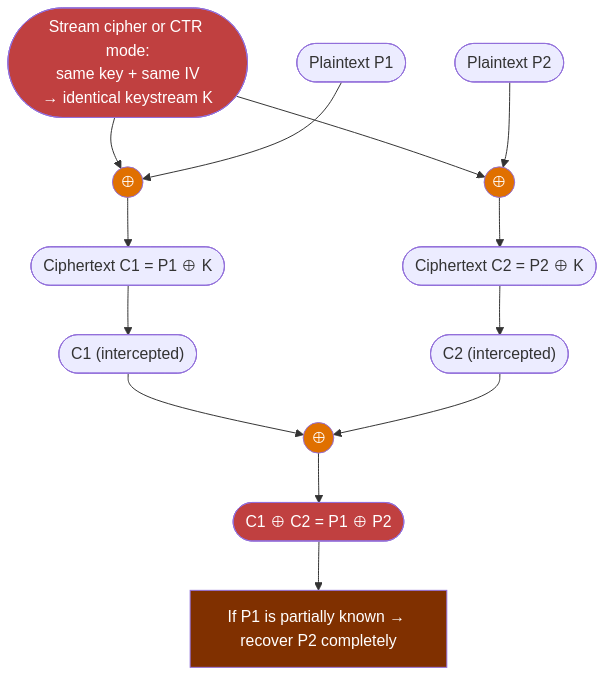
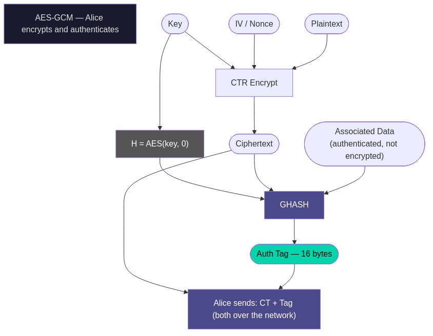
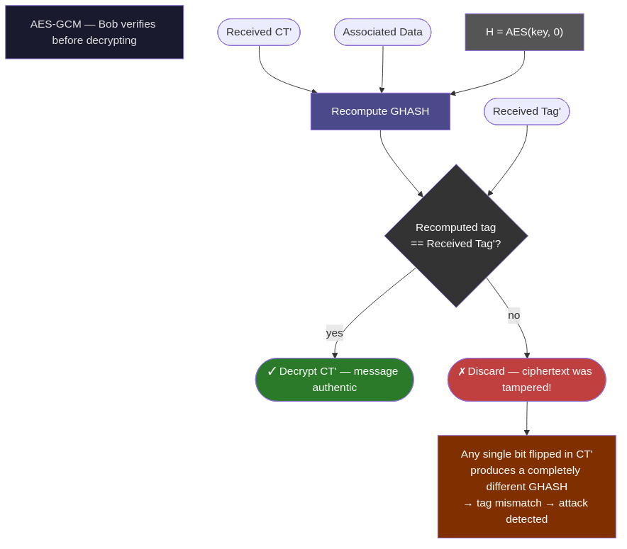

# Open Questions — Answers

**Session 02 — Symmetric Cryptography**

---

### 1. In step 1e, Darth can see that Alice is sending something to Bob, and approximately when and how much data. What does this tell you about what encryption actually protects and what it doesn't?

**ITA**
La crittografia protegge il **contenuto** del messaggio, non i **metadati**. Darth non può leggere il testo, ma può osservare: che Alice e Bob stanno comunicando, quando (orario e durata), quanto spesso e quanti dati vengono trasmessi. Queste informazioni si chiamano _traffic analysis_ e possono essere molto rivelatrici anche senza decrittare nulla — ad esempio, un picco di traffico cifrato tra due nodi prima di un evento importante può essere significativo di per sé. Soluzioni parziali: padding dei messaggi a lunghezza fissa, traffico dummy per mascherare i pattern temporali. Soluzioni più forti: Tor e reti onion, che nascondono anche la sorgente e la destinazione.

**ENG**
Encryption protects the **content** of a message, not the **metadata**. Darth cannot read the text, but can observe: that Alice and Bob are communicating, when (timing and duration), how often, and how much data is being transmitted. This is called _traffic analysis_ and can be highly revealing without decrypting anything — for example, a spike of encrypted traffic between two nodes before a significant event can be meaningful on its own. Partial mitigations: padding messages to a fixed length, dummy traffic to mask timing patterns. Stronger solutions: Tor and onion networks, which hide source and destination as well.

---

### 2. `cryptocat.py` uses `openssl enc` via subprocess for each message. What are the performance implications of this design? How would a production encrypted chat application differ?

**ITA**
Ogni messaggio avvia un processo `openssl` separato — fork, exec, inizializzazione OpenSSL, derivazione PBKDF2 con 10.000 iterazioni, cifratura, terminazione del processo. Per un singolo messaggio è impercettibile, ma scala malissimo: con messaggi brevi e frequenti il costo dominante è l'overhead del processo, non la crittografia. Un'applicazione di produzione deriverebbe la chiave **una sola volta** all'apertura della sessione e la manterrebbe in memoria, cifrando ogni messaggio con una chiamata diretta alla libreria (pycryptodome, libsodium, ecc.) senza subprocessi. Userebbe anche AES-GCM invece di CBC, aggiungendo autenticazione. In TLS questo è esattamente quello che succede: il handshake negozia le chiavi di sessione una volta, poi ogni record viene cifrato con una singola chiamata alla primitiva.

**ENG**
Each message spawns a separate `openssl` process — fork, exec, OpenSSL initialization, PBKDF2 key derivation with 10,000 iterations, encryption, process termination. For a single message this is imperceptible, but it scales poorly: with short, frequent messages the dominant cost is process overhead, not cryptography. A production application would derive the key **once** at session startup, keep it in memory, and encrypt each message with a direct library call (pycryptodome, libsodium, etc.) without subprocesses. It would also use AES-GCM instead of CBC, adding authentication. In TLS this is exactly what happens: the handshake negotiates session keys once, then each record is encrypted with a single primitive call.

---

### 3. `steghide info` can detect that a payload is present. What does this mean for steganography as a defence against a determined attacker who knows to look for it?

**ITA**
Significa che steghide non offre _sicurezza_ contro un attaccante determinato — offre _oscurità_ contro un osservatore casuale. Se l'attaccante sa che steganografia è in uso (o sospetta che lo sia) e applica `steghide info` a tutte le immagini intercettate, può rilevare sistematicamente la presenza di payload nascosti. Non potrà leggerne il contenuto senza la password, ma saprà che qualcosa c'è — e questo da solo può essere un'informazione compromettente. La conclusione pratica: steganografia senza crittografia è inutile; crittografia senza steganografia è sufficiente nella maggior parte dei casi; le due insieme sono utili solo se l'avversario non sa che stai usando steganografia e non ha strumenti di steganalisi. Contro un avversario sofisticato che analizza il traffico, la steganografia LSB è rilevabile statisticamente anche senza `steghide info`.

**ENG**
It means steghide does not provide _security_ against a determined attacker — it provides _obscurity_ against a casual observer. If the attacker knows (or suspects) that steganography is in use and runs `steghide info` on every intercepted image, they can systematically detect the presence of hidden payloads. They cannot read the content without the password, but knowing that something is there can itself be compromising. The practical conclusion: steganography without encryption is useless; encryption without steganography is sufficient in most cases; the two together are only useful if the adversary does not know steganography is being used and lacks steganalysis tools. Against a sophisticated adversary performing traffic analysis, LSB steganography is statistically detectable even without `steghide info`.

---

### 4. In experiment 4b, the fixed IV leaks the fact that two messages are identical. In some older stream cipher modes (not CBC), IV reuse is catastrophic in a much stronger sense — it allows full plaintext recovery. Can you think of why?



**ITA**
Nei cifrari a flusso (o nelle modalità di cifratura a blocchi che si comportano come stream cipher, es. CTR), la cifratura funziona così: si genera un _keystream_ a partire dalla chiave e dall'IV, poi si fa XOR del keystream con il plaintext. Se lo stesso IV viene riusato con la stessa chiave, il keystream è identico per entrambi i messaggi. Chiama i due plaintext P1 e P2 e i due ciphertext C1 e C2:

```
C1 = P1 XOR keystream
C2 = P2 XOR keystream
```

Allora:

```
C1 XOR C2 = P1 XOR P2
```

L'attaccante che ha C1 e C2 può calcolare `C1 XOR C2 = P1 XOR P2` senza conoscere la chiave. Se uno dei due plaintext è parzialmente noto (o indovinabile — es. intestazioni HTTP, protocolli strutturati), l'altro si recupera per intero. Questo attacco si chiama _two-time pad_ ed è il motivo per cui il one-time pad richiede che la chiave non venga mai riusata. In CBC questo non succede perché il chaining introduce dipendenza tra blocchi, ma IV reuse in CBC produce comunque leakage parziale sul primo blocco.

**ENG**
In stream ciphers (or block cipher modes that behave like stream ciphers, e.g., CTR), encryption works as follows: a _keystream_ is generated from the key and IV, then XOR'd with the plaintext. If the same IV is reused with the same key, the keystream is identical for both messages. Call the two plaintexts P1 and P2 and the two ciphertexts C1 and C2:

```
C1 = P1 XOR keystream
C2 = P2 XOR keystream
```

Then:

```
C1 XOR C2 = P1 XOR P2
```

An attacker who has C1 and C2 can compute `C1 XOR C2 = P1 XOR P2` without knowing the key. If one plaintext is partially known (or guessable — e.g., HTTP headers, structured protocols), the other is fully recoverable. This attack is called the _two-time pad_ and is why the one-time pad requires that the key never be reused. In CBC this does not occur because chaining introduces inter-block dependency, but IV reuse in CBC still produces partial leakage on the first block.

---

### 5. AES-GCM adds authentication to encryption. What attack does authentication prevent that CBC alone does not?





**ITA**
CBC senza autenticazione è vulnerabile agli attacchi di **bit-flipping** e, in certi scenari, a attacchi **padding oracle**. Nel bit-flipping: modificare un bit nel ciphertext causa un cambiamento prevedibile e controllato nel blocco plaintext successivo dopo la decrittazione. Un attaccante che intercetta un ciphertext CBC può modificare byte specifici del ciphertext per alterare il plaintext decifrato da Bob in modi controllati — senza conoscere la chiave e senza che Bob si accorga della manomissione (a meno che non ci sia un checksum applicativo). In GCM, ogni ciphertext include un **authentication tag** calcolato sulla chiave, sull'IV, sui dati cifrati e sugli associated data. Qualsiasi modifica al ciphertext invalida il tag — il ricevente rifiuta il messaggio prima ancora di decifrarlo. Questo garantisce **integrità** e **autenticità** oltre alla confidenzialità. In TLS 1.3 AES-GCM è obbligatorio proprio per questa ragione: confidenzialità senza autenticità non è sufficiente in un protocollo di rete.

**ENG**
CBC without authentication is vulnerable to **bit-flipping** attacks and, in certain scenarios, **padding oracle** attacks. In bit-flipping: modifying a bit in the ciphertext causes a predictable, controlled change in the next plaintext block after decryption. An attacker who intercepts a CBC ciphertext can modify specific ciphertext bytes to alter the plaintext Bob decrypts in controlled ways — without knowing the key and without Bob detecting the tampering (unless there is an application-layer checksum). In GCM, every ciphertext includes an **authentication tag** computed over the key, IV, encrypted data, and associated data. Any modification to the ciphertext invalidates the tag — the receiver rejects the message before even decrypting it. This guarantees **integrity** and **authenticity** in addition to confidentiality. In TLS 1.3, AES-GCM is mandatory for exactly this reason: confidentiality without authenticity is insufficient in a network protocol.
